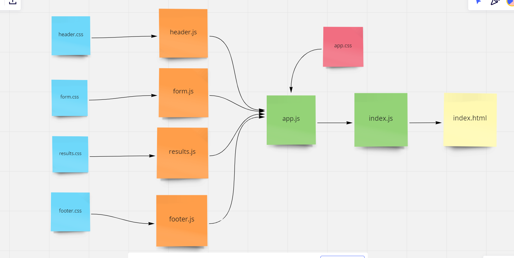

# resty

It's an API testing tool that can be run in any browser, allowing a user to easily interact with APIs in a familiar interface.

## PR url

https://github.com/saadomaralzoubi/resty/pull/2

## UML

